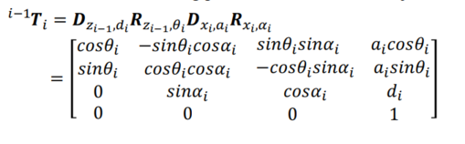
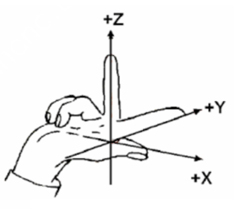
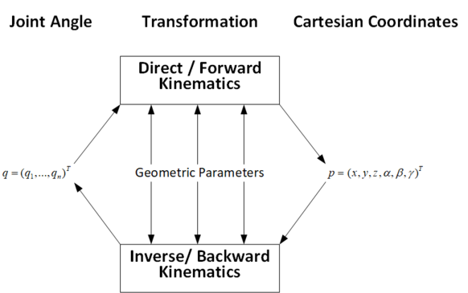

<h1 align="center" id="title">6-DOF robotic arm: Kinematics solution</h1>

<h1><strong>Contents:</strong></h1>

1.  **Knowledge requirements**

2.  **Forward kinematics**

3.  **Inverse kinematics**

4.  **Forward velocity kinematics**

Note: This post covers a specific aspect of kinematics, mainly focus for
my practice robot. Sections 2, 3, and 4 discuss one method for solving
kinematics problems, but many other methods exist. A 6 degrees of
freedom (DOF) robot is the most common type due to its full spatial
control, which robots with fewer DOFs lack. Additionally, a 6-DOF base
allows for easier implementation of robots with higher DOFs, so the
definitions and my practice robot will mainly about 6-DOF robot.

<h2><strong>1. Knowledge requirements</strong></h2>

First of all, you may want to know this information before process to
kinematics, it helps you aware of definitions and have a base
calculation for kinematics.

Robot components: Link, joint, manipulator, twist, end-effector

Degrees of freedom

Rotation about Global Cartesian Axes

Rotation about Local Cartesian Axes

Axis-Angle Rotation and Orientation kinematics

Rigid Body Motion

Homogeneous Transformation

<h2><strong>2. Forward kinematics</strong></h2>

Kinematics is a field of science that studies the motion of objects
without considering the forces that cause those motions. Within the
scope of kinematics, researchers focus on the position, velocity,
acceleration, and higher-order derivatives of position variables (with
respect to time or any other variables) for the links in a static
system. Therefore, studying the kinematics of actuators involves
addressing all the geometric and time-based properties of motion. The
relationship between these motions and the forces and torques that cause
them forms the subject of dynamics, which examines the velocity and
acceleration factors in greater depth.

A fundamental problem in the study of mechanical control is forward
kinematics. Forward kinematics is the problem of determining the
position and orientation of all links on a robot, including the
end-effector, based on the kinematic variables of the given joints. In
forward kinematics, we assign a working coordinate space to each
individual link of the object and calculate its configuration in
adjacent coordinate spaces using the method of "rigid motion." The
analysis of determining the relative positions and motions of all the
robot's links to each other is called forward kinematics. Generally, the
most basic task of forward kinematics is to determine the position and
orientation in space of the end-effector within the base coordinate
system. Sometimes, this is akin to transforming the representation of
the actuator's position in ordinary space into a representation in
Cartesian coordinate space.

The problem of this task can be solved by determining the transformation
matrix $T_{i}$ to describe the kinematic information of joint (i) in the
base coordinate workspace. The traditional method for constructing
forward kinematic equations for robot manipulators is to link them using
the Denavit-Hartenberg notation. Therefore, the forward kinematics
problem essentially involves the manipulation and establishment of these
transformation matrices.

Basically, forward kinematics involves determining the final position of
the robot from its initial position and the rotation angles of its
joints. By using these inputs, we can calculate the robot's end
position.

The transformation matrix from one coordinate system to another in space
is established as follows, derived from rotations around the x, y, z
axes, and translations. For a 6-degree-of-freedom robot, we have six
successive transformation matrices from 1 to 6.

Forward kinematics – DH table:

**+ Step 1:** Determine the number of joints and the number of links.

**+ Step 2:** Attach the coordinate frames from 0 to n onto the links.

Method for determining the Zi axis: It is the axis around which joint
i+1 rotates or along which it translates. (i = 1 to n-1)

Method for determining the Xi axis: The X-axis is typically aligned with
the common normal and points from joint i to i+1. If the joint axes
intersect, X is chosen as the cross product of Zi-1 and Zi.

Method for determining the Yi axis: Determined following the right-hand
rule.

**Special cases:**

If Zi intersects Zi-1, Xi is perpendicular to both Z axes, with
direction and position arbitrarily chosen.

If Zi and Zi-1 are parallel, any Xi can be chosen, typically passing
through the origin of Zi-1.

If Zi and Zi-1 are not coplanar, Xi points from Zi-1 to Zi in 3D space,
forming the coordinate system intersection.

**+ Step 3:** Determine the relationship between two coordinate frames i
and i-1 and create the Denavit-Hartenberg (DH) table.

The general transformation matrix 𝑇06​ is obtained by multiplying the
individual transformation matrices:

T06=T01×T12×T23×T34×T45×T56 ​

If we have the joint angles 𝜃1, 𝜃2, 𝜃3, 𝜃4, 𝜃5, 𝜃6, we can calculate the
𝑇06​ matrix as a 4x4 matrix. Then, by substituting the coordinate
position of the end point in its own coordinate system (body), we obtain
its position in the original global coordinate system (global), the
4th parameter of coordinate is 1 to match 4x4 matrix.

Gr = GTB.Br

<h2><strong>3. Inverse kinematics</strong></h2>

Inverse kinematics is found when we have the initial and final positions
of the robot in the entire local space, along with the configuration and
dimensions of the robot. We then determine the appropriate rotation
angles for the robot to reach the desired position.

With the decoupling method, we consider the joint between the arm and
the end effector as the wrist. Thus, we have the wrist joint at the
intersection of the three final axes, dividing the problem into
positional analysis for the wrist joint and rotation angle from the
wrist to the end effector.

Provide the desired general homogeneous matrix, input is the position
and orientation of end-effector.

$H = \begin{bmatrix}
R_{6}^{0} & d_{6}^{0} \\
0 & 1
\end{bmatrix}$

We calculate end-effector base on wrist point $\begin{bmatrix}
x_{c} \\
y_{c} \\
z_{c}
\end{bmatrix} = \begin{bmatrix}
O_{x} - d_{6}r_{13} \\
O_{y} - d_{6}r_{23} \\
O_{z} - d_{6}r_{33}
\end{bmatrix}$

d6 is distance from end-effector to wrist point.

From $R_{3}^{0}$ calculated with DH three first matrix we have

$$R_{6}^{0} = R_{3}^{0}.R_{6}^{3}$$

Then

$$R_{6}^{3} = {{\lbrack R}_{3}^{0}\rbrack}^{- 1}.R_{6}^{0}$$

With $R_{6}^{3}$ we can calculate last three joint angles.

$$R_{6}^{3} = \begin{bmatrix}
q_{11} & q_{12} & q_{13} \\
q_{21} & q_{22} & q_{23} \\
q_{31} & q_{32} & q_{33}
\end{bmatrix}$$

We can get joint angle directly by:

Solution 1:

$$\theta_{4} = atan2(q_{23},q_{13})$$

$$\theta_{5} = atan2(\sqrt{q_{23}^{2} + q_{13}^{2}},q_{33})$$

$$\theta_{6} = atan2( - q_{32},q_{31})$$

Note that $0 \leq \theta_{5} \leq \pi$ and $\theta_{4} < \pi$

Solution 2:

$$\theta_{4}^{'} = \theta_{4} + \pi$$

$$\theta_{5}^{'} = \  - \theta_{5}$$

$$\theta_{6}^{'} = \theta_{6} + \pi$$

$$\theta_{4}^{'} = atan2({- q}_{23}, - q_{13})$$

$$\theta_{5}^{'}\  = atan2( - \sqrt{q_{23}^{2} + q_{13}^{2}},q_{33})$$

$$\theta_{6}^{'} = atan2( - q_{32}, - q_{31})$$

<h2><strong style="font-size: 1.5em;">4. Forward velocity kinematics</strong></h2>

> Calculate forward velocity kinematics to determine the velocity of the
> end point for use in path planning, motion control, sensor
> calibrating, etc.
>
> The input parameters for kinematics are the joint angles and their
> velocities (derivatives of joint angles with respect to time).
>
> **Steps to follow:**

- Define joint angles and velocities:

> Get the joint angles
> $(\theta_{1},\theta_{2},\theta_{3},\theta_{4},\theta_{5},\theta_{6})$
> and joint velocities
> $(\dot{\theta_{1}},\dot{\theta_{2}},\dot{\theta_{3}},\dot{\theta_{4}},\dot{\theta_{5}},\dot{\theta_{6}})$

- Define DH parameters:

> Establish the Denavit-Hartenberg (DH) parameters for the robotic arm.

- Compute Forward Kinematics:

> Using the DH parameters and joint angles, compute the transformation
> matrices from the base frame to each subsequent joint frame
>
> $$T_{i - 1}^{i} = \begin{bmatrix}
> \cos\theta_{i} & - sin\theta_{i}\cos\alpha_{i} & \sin\theta_{i}\sin\alpha_{i} & a_{i}\cos\theta_{i} \\
> \sin\theta_{i} & \cos\theta_{i}\cos\alpha_{i} & - cos\theta_{i}\sin\alpha_{i} & a_{i}\sin\theta_{i} \\
> 0 & \sin\alpha_{i} & cos\alpha_{i} & d_{i} \\
> 0 & 0 & 0 & 1
> \end{bmatrix}$$
>
> The transformation matrix $T_{i - 1}^{i}$ transform coordinate frames
> $B_{i}$ to $B_{i - 1}$.
>
> Calculate the overall transformation matrix from the base to the
> end-effector by multiplying the individual transformation matrix
>
> $$T_{0}^{6} = T_{0}^{1}.T_{1}^{2}.T_{2}^{3}.T_{3}^{4}.T_{4}^{5}.T_{5}^{6}$$
>
> Extract the position components from the transformation matrix
>
> $$P_{x} = T_{0}^{6}(1,4),\ P_{y} = T_{0}^{6}(2,4),\ P_{z} = T_{0}^{6}(3,4)$$

- Compute the Jacobian Matrix

> Calculate the Jacobian matrix, which consists of the position and
> orientation components
>
> $$J = \begin{bmatrix}
> \frac{\partial P_{x}}{\partial\theta_{1}} & \frac{\partial P_{x}}{\partial\theta_{2}} & \frac{\partial P_{x}}{\partial\theta_{1}} & \frac{\partial P_{x}}{\partial\theta_{4}} & \frac{\partial P_{x}}{\partial\theta_{5}} & \frac{\partial P_{x}}{\partial\theta_{6}} \\
> \frac{\partial P_{y}}{\partial\theta_{1}} & \frac{\partial P_{y}}{\partial\theta_{2}} & \frac{\partial P_{y}}{\partial\theta_{3}} & \frac{\partial P_{y}}{\partial\theta_{4}} & \frac{\partial P_{y}}{\partial\theta_{5}} & \frac{\partial P_{y}}{\partial\theta_{6}} \\
> \frac{\partial P_{z}}{\partial\theta_{1}} & \frac{\partial P_{z}}{\partial\theta_{2}} & \frac{\partial P_{z}}{\partial\theta_{3}} & \frac{\partial P_{z}}{\partial\theta_{4}} & \frac{\partial P_{z}}{\partial\theta_{5}} & \frac{\partial P_{z}}{\partial\theta_{6}} \\
> T_{0}^{1}(1,3) & T_{0}^{2}(1,3) & T_{0}^{3}(1,3) & T_{0}^{4}(1,3) & T_{0}^{5}(1,3) & T_{0}^{6}(1,3) \\
> T_{0}^{1}(2,3) & T_{0}^{2}(1,3) & T_{0}^{3}(2,3) & T_{0}^{4}(2,3) & T_{0}^{5}(2,3) & T_{0}^{6}(2,3) \\
> T_{0}^{1}(3,3) & T_{0}^{2}(1,3) & T_{0}^{3}(3,3) & T_{0}^{4}(3,3) & T_{0}^{5}(3,3) & T_{0}^{6}(3,3)
> \end{bmatrix}$$

- Substitute joint angles into the Jacobian:

> Substitute the given joint angles into the Jacobian matrix to obtain a
> numerical Jacobian matrix.

- Calculate end-effector velocities:

> Compute the end-effector velocities by multiplying the Jacobian matrix
> with the joint velocity vector
>
> $$V = J\begin{bmatrix}
> \dot{\theta_{1}} \\
> \dot{\theta_{2}} \\
> \dot{\theta_{3}} \\
> \dot{\theta_{4}} \\
> \dot{\theta_{5}} \\
> \dot{\theta_{6}}
> \end{bmatrix}$$

For example robot, see 6DOF-robot/readme_en.txt for more information.
